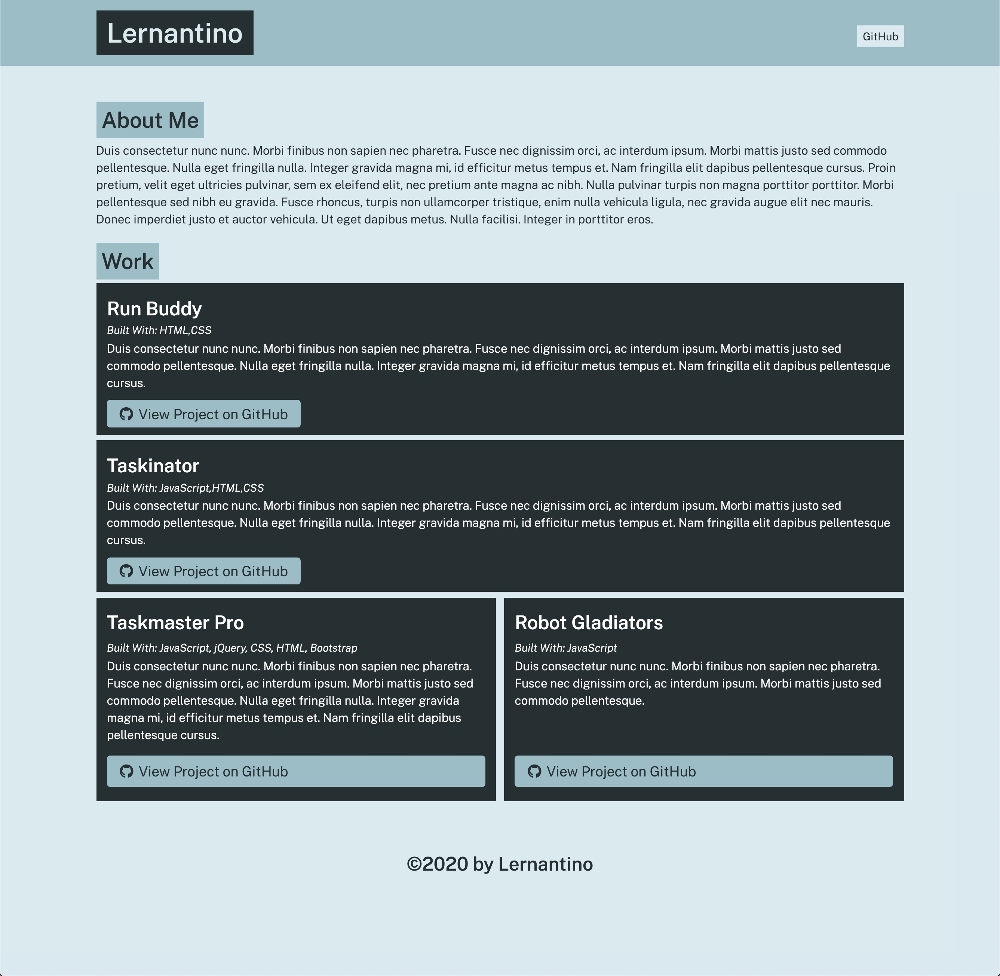

# Portfolio Generator

## Description:

This is a command-line application that dynamically generates a portfolio HTML file from a user's input using the Inquirer package.

## Technologies:

Project is created with:

- Javascript
- Node.js
- Inquirer.js

## Installation

To run this project, install it locally using npm:

```
npm i
```

## Usage

After installing npm packages, the application will be invoked by using the following command: `node index.js`.
It accepts user input, and can display the results on a formatted HTML file generated in the dist folder.

### Example Screenshot



## Contribution

Made by Wenwen Tian
